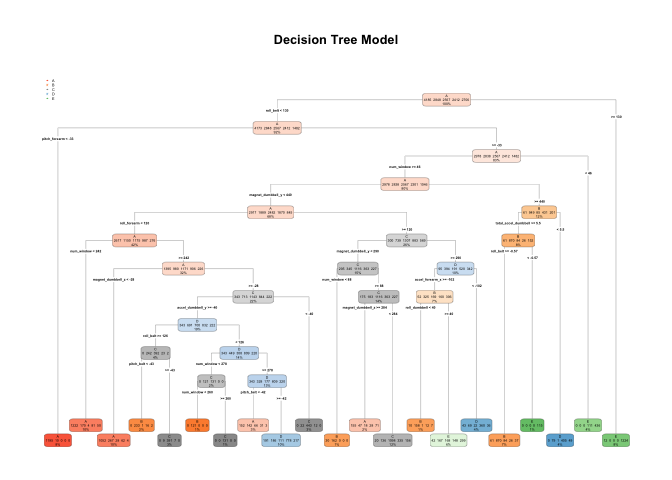

# Practical Machine Learning Course Project
Yuyu Zeng  
`r format(Sys.Date(), "%B %d, %Y")`  


## Synoposis
In this project, we use the data from personal activity to quantify how well the participant do a particular activity. The "classe" is the variable that is going to be predicted. Firstly, we extract relevant predictors. Then, we implement two relevant models for the multi-class classification problem, i.e., the decision tree and random forest models to check which model perform better. Finally, we use the chosen model to predict 20 different test cases. It turns out that the random forest model perform better in terms of the accuracy, therefore we have enough reasons to implement the random forest model to predict the test cases.


```r
library(caret)
```

```
## Warning: package 'caret' was built under R version 3.2.5
```

```
## Loading required package: lattice
```

```
## Loading required package: ggplot2
```

```r
library(knitr)
```

```
## Warning: package 'knitr' was built under R version 3.2.5
```

```r
library(rpart)
library(rpart.plot)
```

```
## Warning: package 'rpart.plot' was built under R version 3.2.5
```

```r
library(markdown)
library(randomForest)
```

```
## randomForest 4.6-12
```

```
## Type rfNews() to see new features/changes/bug fixes.
```

```
## 
## Attaching package: 'randomForest'
```

```
## The following object is masked from 'package:ggplot2':
## 
##     margin
```

## Download and read the data sets
This R code supports download training and testing datasets directly from the website. We read the data sets after having download them. 


```r
setwd("/Users/yuyu/Desktop/DataScientist/MachineLearning/PracticalMachineLearningDataScienceTrackCoursera/week4/FinalProject")
trainURL <- "https://d396qusza40orc.cloudfront.net/predmachlearn/pml-training.csv"
testURL <- "https://d396qusza40orc.cloudfront.net/predmachlearn/pml-testing.csv"
download.file(trainURL, destfile = "./traindat")
download.file(testURL, destfile="./testdat")
traindat <- read.csv("traindat")
testdat <- read.csv("testdat")
```

## Preprocessing data
We split the "traindat" into training (75 percent) and testing (25 percent) data sets. We do the following procesured to pre-process the data. Firstly, we remove near zero-variance predictors; then, we remove predictors with more than 60 percent missing values; finally, we remove intuitively bad predictors (e.g., ID number, user names and recording times etc). Note that in the steps of splitting data, removing "near zero-variance", predictors with more than 80 percent missing values and intuitively bad predcitors, we check the dimensions of training and testing data sets after the corresponding steps are implemented. 

```r
# split the traindat into training and testing data sets
inTrain <- createDataPartition(traindat$classe, p = 0.75, list=FALSE)
mytraining <- traindat[inTrain,]
mytesting <- traindat[-inTrain,]
dim(mytraining); dim(mytesting)
```

```
## [1] 14718   160
```

```
## [1] 4904  160
```

```r
#remove "near zero-variance" predictors
nzv <- nearZeroVar(mytraining, saveMetrics = TRUE)
mytraining <- mytraining[,nzv$nzv==FALSE]
mytesting <- mytesting[,nzv$nzv==FALSE]
dim(mytraining); dim(mytesting)
```

```
## [1] 14718   107
```

```
## [1] 4904  107
```

```r
#remove predictors with more than 80 percent missing values
mytraining <- mytraining[, -which(colMeans(is.na(mytraining)) > 0.8)]; mytesting <- mytesting[,names(mytraining)]; 
dim(mytraining); dim(mytesting);
```

```
## [1] 14718    59
```

```
## [1] 4904   59
```

```r
#remove the predictors that are not intuitively relevant
mytraining <- mytraining[, -c(1:5)];
mytesting <- mytesting[,-c(1:5)]; 
dim(mytraining); dim(mytesting);
```

```
## [1] 14718    54
```

```
## [1] 4904   54
```
From the above results, we can see that after removing some predictors, we end up with predictors 53 in the end (note that "classe" is the variable we are going to predict).

## Prediction with Decision Trees
As this is a multi-class classification problem, we can try to implement the decision tree model.

```r
set.seed(12345)
dtm <- rpart(classe ~., data=mytraining, method = "class")
rpart.plot(dtm, type = 4, extra = 101, main = "Decision Tree Model")
```

<!-- -->

```r
#using the decision tree model to predict
p <-predict(dtm,mytesting, type="class")
confusionMatrix(p,mytesting$classe)
```

```
## Confusion Matrix and Statistics
## 
##           Reference
## Prediction    A    B    C    D    E
##          A 1266  208   39   72   41
##          B   33  529   24   24   20
##          C   10   47  687  122   59
##          D   66  119   51  511  112
##          E   20   46   54   75  669
## 
## Overall Statistics
##                                           
##                Accuracy : 0.7467          
##                  95% CI : (0.7343, 0.7589)
##     No Information Rate : 0.2845          
##     P-Value [Acc > NIR] : < 2.2e-16       
##                                           
##                   Kappa : 0.6781          
##  Mcnemar's Test P-Value : < 2.2e-16       
## 
## Statistics by Class:
## 
##                      Class: A Class: B Class: C Class: D Class: E
## Sensitivity            0.9075   0.5574   0.8035   0.6356   0.7425
## Specificity            0.8974   0.9745   0.9412   0.9151   0.9513
## Pos Pred Value         0.7786   0.8397   0.7427   0.5949   0.7743
## Neg Pred Value         0.9606   0.9017   0.9578   0.9276   0.9426
## Prevalence             0.2845   0.1935   0.1743   0.1639   0.1837
## Detection Rate         0.2582   0.1079   0.1401   0.1042   0.1364
## Detection Prevalence   0.3316   0.1285   0.1886   0.1752   0.1762
## Balanced Accuracy      0.9025   0.7659   0.8724   0.7753   0.8469
```

## Prediction with Random Forests
We also try the random forests model to do the classification and check whether there are some improvements in the accuracy. 

```r
rfm <-randomForest(classe~., data=mytraining)
p<-predict(rfm, mytesting, type="class")
confusionMatrix(p,mytesting$classe)
```

```
## Confusion Matrix and Statistics
## 
##           Reference
## Prediction    A    B    C    D    E
##          A 1395    0    0    0    0
##          B    0  949    6    0    0
##          C    0    0  849    6    0
##          D    0    0    0  798    2
##          E    0    0    0    0  899
## 
## Overall Statistics
##                                           
##                Accuracy : 0.9971          
##                  95% CI : (0.9952, 0.9984)
##     No Information Rate : 0.2845          
##     P-Value [Acc > NIR] : < 2.2e-16       
##                                           
##                   Kappa : 0.9964          
##  Mcnemar's Test P-Value : NA              
## 
## Statistics by Class:
## 
##                      Class: A Class: B Class: C Class: D Class: E
## Sensitivity            1.0000   1.0000   0.9930   0.9925   0.9978
## Specificity            1.0000   0.9985   0.9985   0.9995   1.0000
## Pos Pred Value         1.0000   0.9937   0.9930   0.9975   1.0000
## Neg Pred Value         1.0000   1.0000   0.9985   0.9985   0.9995
## Prevalence             0.2845   0.1935   0.1743   0.1639   0.1837
## Detection Rate         0.2845   0.1935   0.1731   0.1627   0.1833
## Detection Prevalence   0.2845   0.1947   0.1743   0.1631   0.1833
## Balanced Accuracy      1.0000   0.9992   0.9958   0.9960   0.9989
```
Indeed, we see there is a big improvement in the accuracy compared with the decision tree model. As the accuracy for the testing data set is 0.9969, the out of sample error is (1-0.9969)=0.0031. Therefore, we are in favor of the random forest model over the decision tree model. 

## Prediction for the test cases
Now we use the random forest model to predict 20 different test cases. 

```r
predict(rfm, testdat, type = "class")
```

```
##  1  2  3  4  5  6  7  8  9 10 11 12 13 14 15 16 17 18 19 20 
##  B  A  B  A  A  E  D  B  A  A  B  C  B  A  E  E  A  B  B  B 
## Levels: A B C D E
```
